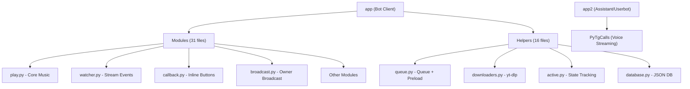

# Anisha Music Bot — Scope Analysis + Two New Features

## Current Codebase Scope & Improvement Areas

After a deep review of the entire project, here's a breakdown of the current architecture and where improvements can be made:

### Current Architecture Overview



### Identified Improvement Areas

| Area | Current State | Improvement Scope |
|------|--------------|-------------------|
| **Error Handling** | Bare `except: pass` in many places | Add specific exception catches, better logging |
| **Code Duplication** | Stream creation code repeated 5+ times across play.py, callback.py, watcher.py | Extract into a shared helper `create_stream()` |
| **Database** | Flat JSON file (`db.json`), no served-chats tracking | Could track served groups for better broadcast |
| **Admin Check** | Calls `get_chat_member` twice in `admin_check` (line 41 & 48 of admins.py) | Single call, reuse result |
| **Broadcast** | Only forwards via `app2` (assistant), no tracking of failed/success per chat | Could use bot client too, add stats |
| **Downloads Cleanup** | Manual `/rmdownloads`, no auto-cleanup | Could auto-purge files older than X hours |
| **Startup Notification** | Only sends to support chat | **Your Feature #1** — notify all groups |
| **No Member Tagger** | Doesn't exist | **Your Feature #2** — `/all` command |

---

## Feature #1: Startup Notification to All Groups

### What It Does
When the bot boots up and goes live, it sends a stylish "I'm active, enjoy the music!" notification to **every group** where the bot can send messages.

### Proposed Changes

---

#### [MODIFY] [__main__.py](file:///c:/Users/jatin%20dalal/Downloads/Bots/Music%20Bot/AnishaMusic/__main__.py)

Add a new `startup_notify_groups()` function that:
1. Iterates through all `app2` dialogs (groups/supergroups the assistant is in)
2. Sends a beautifully formatted startup message via the **bot client (`app`)** to each group
3. Handles `FloodWait` gracefully (sleep and retry) and skips on errors
4. Runs as a background task so it doesn't block startup
5. Logs how many groups were notified

The startup message will be stylish, like:
```
✯ ᴀɴɪsʜᴀ ᴍᴜsɪᴄ ɪs ɴᴏᴡ ᴏɴʟɪɴᴇ ✯

🎶 ʜᴇʏ ᴇᴠᴇʀʏᴏɴᴇ! ᴛʜᴇ ᴍᴜsɪᴄ ʙᴏᴛ ɪs ʙᴀᴄᴋ ᴀɴᴅ ʀᴇᴀᴅʏ ᴛᴏ ᴠɪʙᴇ 🎧

➻ ᴊᴜsᴛ ᴛʏᴘᴇ /play ᴀɴᴅ ʟᴇᴛ ᴛʜᴇ ᴍᴜsɪᴄ ᴛᴀᴋᴇ ᴏᴠᴇʀ 🔊

❛ ᴡʜᴇʀᴇ ᴇᴠᴇʀʏ ɴᴏᴛᴇ ғɪɴᴅs ɪᴛs ʜᴏᴍᴇ ❜ 🥀
```

> [!IMPORTANT]
> The bot needs to be an actual member of the groups (with send-message permissions) for this to work. We'll iterate the **bot's own dialogs** (via `app.get_dialogs()`) to ensure we only notify groups where the bot itself can send messages — not just groups the assistant is in.

---

## Feature #2: Interactive `/all` Member Tagger

### What It Does
A `/all` (or `@all`) command that tags **every member** of the group, one-by-one, with 7-8 members per message, 7 seconds wait between batches, and **180-200 unique fun/interactive messages** so every tag batch feels fresh.

### Behavior Logic
| Scenario | Behavior |
|----------|----------|
| `/all` (plain, no reply, no extra text) | Sends a simple tag-all with fun random messages, no reply quote |
| `/all some message here` | Uses the custom message + tags, 7sec delay between batches |
| `/all` (replying to a message) | Uses the replied message as context + tags, 7sec delay between batches |
| Same user tagged twice? | **Never** — each user is tracked per session and skipped if already tagged |
| Bot/Deleted accounts? | Automatically skipped |
| Who can use it? | Any group member (not restricted to admins) |
| Cancel mid-way? | `/cancel` or `/stop` to abort tagging |

### Proposed Changes

---

#### [NEW] [tagall.py](file:///c:/Users/jatin%20dalal/Downloads/Bots/Music%20Bot/AnishaMusic/Modules/tagall.py)

New module with:

1. **200 unique tag messages** — A massive list of short, fun, interactive one-liners stored in `TAG_MESSAGES` list. Examples:
   - `"🔥 ᴡᴀᴋᴇ ᴜᴘ, ʟᴇɢᴇɴᴅs!"`
   - `"💀 ᴅᴇᴀᴅ ɢʀᴏᴜᴘ? ɴᴏᴛ ᴀɴʏᴍᴏʀᴇ!"`
   - `"🎵 ᴍᴜsɪᴄ ᴛɪᴍᴇ, ᴊᴏɪɴ ᴛʜᴇ ᴠɪʙᴇ!"`
   - `"👀 ᴡʜᴏ's ᴏɴʟɪɴᴇ? sʜᴏᴡ ʏᴏᴜʀsᴇʟғ!"`
   - ... and 196 more

2. **Handler for `/all` and `@all`** — Listens for the command in groups only

3. **Core tagging logic:**
   - Fetches all members via `app.get_chat_members()` (iterates all)
   - Skips bots, deleted accounts, the bot itself, and the assistant
   - Shuffles the 200 messages randomly for variety
   - Groups users into batches of 7-8 per message
   - For **plain `/all`**: sends each batch instantly with a random fun message (no wait)
   - For **`/all <text>` or `/all` replying to a message**: sends each batch with 7-second delay, includes the user's custom message or reply context
   - Tracks tagged user IDs in a set — no repeats
   - Uses `asyncio.sleep(7)` between batches
   - Formats mentions as `[Name](tg://user?id=XXX)` for clickable tags

4. **Active session tracking** — A dict `_active_tag_sessions` keyed by `chat_id` to prevent duplicate runs and allow `/cancel`

5. **Cancel command** — `/cancel` stops any active tagging session in that group

> [!WARNING]
> **Telegram Rate Limits**: Tagging all members with 7sec delays is respectful to Telegram's API limits. However, in very large groups (1000+ members), this could take a long time (~15+ minutes). The cancel command is essential.

> [!IMPORTANT]  
> The `app.get_chat_members()` method requires the bot to be an **admin** in the group to fetch the full member list. If the bot is not admin, it can only see limited members. This is a Telegram API limitation.

---

#### [MODIFY] [dossier.py](file:///c:/Users/jatin%20dalal/Downloads/Bots/Music%20Bot/AnishaMusic/Helpers/dossier.py)

Add the `/all` and `/cancel` commands to the `HELP_TEXT` so users know about the new feature.

---

## Open Questions

> [!IMPORTANT]
> **Q1: Startup notification — which client should send?**
> - **Option A (Recommended):** Bot client (`app`) sends to groups where the bot is a member — cleaner and more "official"
> - **Option B:** Assistant (`app2`) sends — reaches more groups but feels spammy from a userbot
> 
> Currently planning **Option A**. Let me know if you prefer otherwise.

> [!IMPORTANT]
> **Q2: Should the `/all` tagger be restricted to admins only?**
> - Currently planning it for **any group member** since it's a fun community tool
> - But this could be abused in groups. Should we add an admin-only toggle or restrict to admins + SUDOERS?

> [!IMPORTANT]
> **Q3: Startup notification — should it include an inline button (e.g., "Play Music" linking to `/play`)?**
> - A button would make it more interactive, but might seem overly promotional
> - Currently planning plain text. Let me know if you want buttons.

> [!IMPORTANT]
> **Q4: The 200 tag messages — language preference?**
> - Should they be in the **stylized small-caps Unicode** (like the rest of the bot: `ᴡᴀᴋᴇ ᴜᴘ`) or **plain English**?
> - Current plan: Mix of both — mostly small-caps with some emojis for flavor

---

## Verification Plan

### Automated Tests
- Syntax check: `python -m py_compile AnishaMusic/Modules/tagall.py`
- Module loading: Verify `tagall` appears in `ALL_MODULES` via the auto-discovery system
- Dry run: Start bot and check logs for startup notification count

### Manual Verification
- Deploy bot, check that startup message appears in test groups
- Run `/all` in a test group and verify:
  - All members tagged
  - No duplicates
  - 7-second delay with custom message
  - `/cancel` stops mid-tag
  - Fun messages are different each batch
